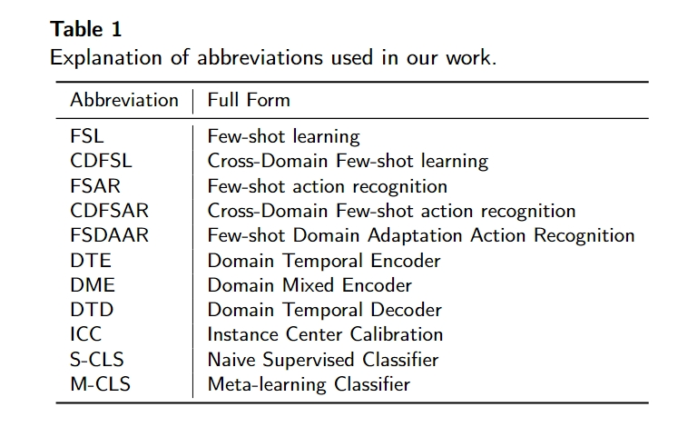
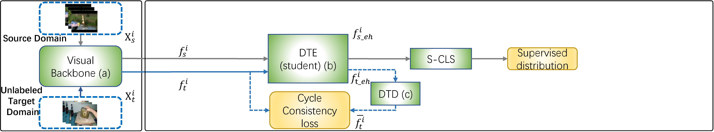
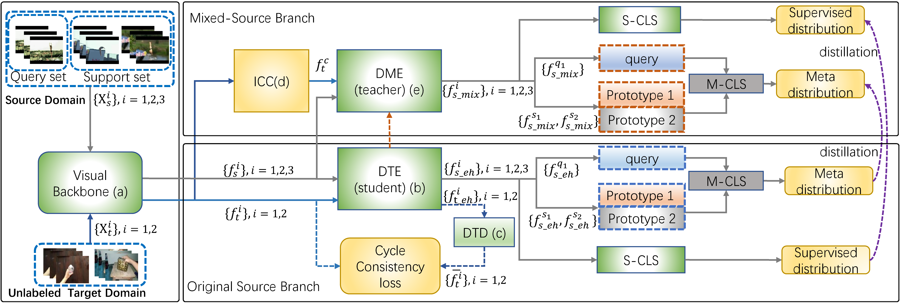

# DMSD-CDFSAR: Distillation from Mixed-Source Domain for Cross-Domain Few-shot Action Recognition

This repo contains code for the method introduced in the paper:

[{DMSD-CDFSAR: Distillation from Mixed-Source Domain for Cross-Domain Few-shot Action Recognition]]
(https://arxiv.org/abs/2407.05657)

## Frame work of the paper

The Pre-training stage. In this stage, we aim to train the backbone, the DTE, DTD, and S-CLS from the Original Source Branch(Please refer to the meta-training stage below.

The Meta-tranining stage. In this stage, we aim to train several components: Firstly, the backbone. 
        In the Original Source Branch, we focus on DTE, DTD, and S-CLS. 
        Simultaneously, In the Mixed-Source Branch, we train the DME and another instance of the S-CLS. The knowledge from the Mixed-Source Branch is then distilled to enhance the Original Source Branch. 

The Framework of DMSD. In this illustration, the modules represented by the green area in both the pre-training stage and the meta-training stage contain the parameters that need to be trained in the network.
For the abbreviations, please refer to Tabel-1.
(\textbf{Note}: 
The blue arrows represent unlabeled target features, 
while the gray arrows represent source features or mixed-source features. 
We use a 2-way 1-shot setting in the illustration. 
We use linear classifier as S-CLS and OTAM as M-CLS.

The structure of the final model in the meta-testing stage is based on the target domain

## Splits
This paper uses the Kinetics as the source domain dataset. The split method follows the SEEN. 
And uses UCF101, HMDB51, SSV2, Diving48, and RareAct as the target domain. The split method for UCF101, HMDB51, SSV2 also follow the [SEEN](https://www.sciencedirect.com/science/article/abs/pii/S1077314223001170), 
and the split methods for Diving48 and RareAct follow the [CDFSL-V](https://github.com/Sarinda251/CDFSL-V). 

The split method in [CMN](https://github.com/ffmpbgrnn/CMN) for Kinetics and SSv2, which are provided by the authors of the authors of [CMN](https://openaccess.thecvf.com/content_ECCV_2018/papers/Linchao_Zhu_Compound_Memory_Networks_ECCV_2018_paper.pdf) (Zhu and Yang, ECCV 2018). We also used the split from [OTAM](https://openaccess.thecvf.com/content_CVPR_2020/papers/Cao_Few-Shot_Video_Classification_via_Temporal_Alignment_CVPR_2020_paper.pdf) (Cao et al. CVPR 2020) for SSv2, and splits from [ARN](https://www.ecva.net/papers/eccv_2020/papers_ECCV/papers/123500511.pdf) (Zhang et al. ECCV 2020) for HMDB and UCF.  These are all the in the splits folder.
can also be used as reference.

## How to train
### In the pre-training stage
We simultaneously train the backbone as well as the
DTE (student), DTD, and S-CLS in the Original Source
Branch. 
### In the meta-training stage
We train the modules
in both branches: 
(1) the DTE (student), DTD, and S-CLS
in the Original Source Branch. (2) the DEM and S-CLS
in the Mixed-Source Branch. We also use the N-way K-
shot meta-training classifier M-CLS in both branches. Then,
we distill knowledge from the Mixed-Source Branch to the
Original Source Branch by leveraging the naive supervised
classification and N-class meta-classification results of both
branches.

## The meta-testing
 In the testing stage, we only conduct testing
in the Original Source Branch using the conventional N-way K-shot meta-testing method.

## Acknowledgements

We use [torch_videovision](https://github.com/hassony2/torch_videovision) for video transforms. 
For the dataset split, please refer to:
[SEEN: Cross-domain few-shot action recognition with unlabeled videos](https://www.sciencedirect.com/science/article/abs/pii/S1077314223001170)
and 
[CDFSL-V: Cross-domain few-shot learning for videos](https://github.com/Sarinda251/CDFSL-V)
